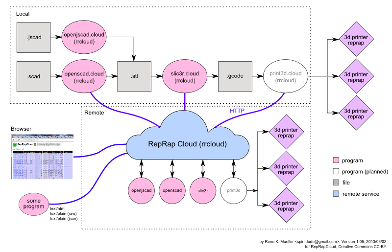

<h1>RepRapCloud</h1>

<b>Version: 0.016 (ALPHA)</b>

<b>RepRapCloud</b> (<tt>rrcloud</tt>) is a small but powerful perl-script which provides an easy framework to relay computational work remote among many servers and retrieve the results locally; both synchronous (returns when done) and asynchronous (returns immediately telling you the state of task 'busy', 'complete' or 'failed').

<pre>
% openscad.cloud test.scad -otest.stl
% openjscad.cloud test.jscad -otest.stl
% slic3r.cloud --load=prusa.conf huge.stl --output=huge.gcode
% printrun.cloud /dev/ttyUSB3 huge.gcode
</pre>

which uses <tt>myserver.local</tt> (as defined in rrcloudrc) and starts there to do the work (openjscad, slicing etc) on the particular server, and returns when the task is done (synchronous).

<pre>
% rrcloud --s=myserver.local openscad test.scad
id: 1361982308-837500
% rrcloud --s=myserver.local openjscad test.jscad
id: 1361982310-219223
% rrcloud --s=myserver.local slic3r --load=prusa.conf huge.stl
id: 1361982318-371735
% rrcloud --s=myserver.local printrun /dev/ttyUSB3 huge.gcode
id: 1361982322-198887
</pre>

does nearly the same, except it returns right away (asynchronous), and if you call <tt>rrcloud info <i>id</i></tt> and see if the job is 'completed' (or 'failed'), the result is found at <tt>tasks/out/<i>id</i>[.ext]</tt> (depending on service proper extension is set).

<b>Note: This is <u>ALPHA</u> software, no thorough security code-review has happened yet, so use it solely in a trusted (local) network.</b>

<h2>Requirements</h2>

<ul>
<li>Perl 
<li>Curl
<li>Apache HTTPD or Lighttpd
<li>multiple machines
<ul>
<li><a href="http://openscad.org">OpenSCAD.org</a> (for .scad -> .stl)
<li><a href="https://github.com/Spiritdude/OpenSCAD.jscad">OpenSCAD.js(cad)</a> & <a href="http://joostn.github.com/OpenJsCad/">OpenJsCad</a> (for .jscad -> .stl)
<li><a href="http://slic3r.org">Slic3r.org</a> (for .stl -> .gcode)
<li><a href="https://github.com/kliment/Printrun">Printrun</a> (for .gcode to printer)
</ul>
</ul>

<h2>What Works</h2>
<ul>
<li><b>openscad</b> (single file input/output), e.g. <tt>openscad.cloud huge.scad -ohuge.stl</tt> (<a href="http://openscad.org/">OpenSCAD</a>)
<li><b>openjscad</b> (single file input/output with support of OpenSCAD.js), e.g. <tt>openjscad.cloud huge.jscad -ohuge.stl</tt> (<a href="https://github.com/Spiritdude/OpenSCAD.jscad">OpenSCAD.js(cad) & OpenJsCad</a>)
<li><b>slic3r</b>, e.g. <tt>slic3r.cloud --load=my.conf huge.stl --output=huge.gcode</tt>
<li><b>printrun</b> e.g. <tt>printrun.cloud /dev/ttyUSB3 huge.gcode</tt>

<li><b>not yet</b> but planned:
<ul>
<li>multiple input files not referenced by arguments (e.g. huge.scad including aa.scad) - likely by support of directory upload (not yet sure)
<li>multi-stage open[j]scad -> slic3r -> printrun
<li>fine-grained progress indicator
<li>suspend/resume/kill of jobs, in particular useful for printrun service
</ul>
</ul>

<h2>History</h2>
<ul>
<li> 2013/03/05: 0.016: native arguments (switches and variables) supported, printrun service added (via Printrun:printcore.py)
<li> 2013/03/04: 0.015: preparing general interface for several dbs (mongodb, mysql, flat-file (default))
<li> 2013/03/03: 0.014: logging, and some code clean-up
<li> 2013/03/02: 0.013: checking preargN for validity
<li> 2013/03/02: 0.012: openjscad service included
<li> 2013/02/25: 0.011: rrcloudrc at various places considered, --local force local
<li> 2013/02/24: 0.009: replaced `` by fork & exec combo, a bit code cleaning up 
<li> 2013/02/24: 0.008: additional prearguments (e.g. --load=file.conf as for slic3r)
<li> 2013/02/23: 0.007: directory support as input (experimental, disabled)
<li> 2013/02/22: 0.005: multiple input files supported, added 'echo' service
<li> 2013/02/19: 0.002: remote stuff slowly working, not yet complete
<li> 2013/02/18: 0.001: first version, simple services of openscad, slic3r working
</ul>

<h2>Install</h2>

<pre>
% cpan Time:HiRes
% make install
</pre>

<h3>Permissions</h3>

Be aware that <tt>rrcloud</tt> is a command-line program (CLI) and a CGI in one, the CLI is execute under your login, whereas the CGI is executed as user <tt>www-data</tt> or so (depends on your UNIX).
<tt>rrcloud</tt> (and <tt>*.cloud</tt>) create
<ul>
<li>tasks/
<ul>
<li>in/
<li>out/
<li>log/
<li>info/
</ul>
</ul>
under that identity, after that if you mix CLI and CGI it may cause premission problems, e.g. <tt>www-data</tt> not having the permission to write files under directories created under your user identity.

<h3>Solution</h3>

<h4>Uniform Use</h4>
Do not mix CLI and CGI, e.g. use <tt>rrcloud</tt> and <tt>*.cloud</tt> as CLI on a local machine, and on a sever only used it to receive requests via CGI but not operated via CLI.

<h4>Mixed Use</h4>
Make user <tt>www-data</tt> part of your group (/etc/group), so user <tt>www-data</tt> can write into directories created by you (your login) - this way you can use the mixed operation.

<b>Note:</b> do not use <tt>rrcloud</tt> on itself, e.g. call <tt>rrcloud --s=localhost info</tt> and which calls the same local <tt>rrcloud</tt>, it will mix up state of the tasks and fail to deliver accurate results.

<h2>Usage: Command Line</h2>

<tt>rrcloud</tt> is a hybrid of CLI and CGI as mentioned, so it can be used on the command-line or web, as client or server:

<h3>Local</h3>

<pre>
% ./openscad.cloud tests/cube.scad -otests/cube.stl
% ./slicer.cloud tests/cube.stl --output=tests/cube.gcode
</pre>

<b>Note:</b> <tt>*.cloud</tt> are just symbolical links (sym-links) to <tt>rrcloud</tt>, depending on the name <tt>rrcloud</tt> behaves accordingly.

<h3>Remote</h3>

Edit <tt>rrcloudrc</tt> in the same directory (or <tt>~/.rrcloudrc</tt>):
<pre>
servers = server.local,server2.local      # , separated list
slic3r.servers = server.local             # server(s) for slic3r.cloud only
openscad.servers = server2.local          # server(s) for openscad.cloud only
printrun.servers = raspberrypi.local      # server(s) for printrun.cloud only
</pre>

then
<pre>
% ./openscad.cloud tests/cube.scad -otests/cube.stl
% ./slicer.cloud tests/cube.stl --output=tests/cube.gcode
</pre>

<h2>Usage: Web</h2>

<tt>index.cgi</tt> is just a sym-link to <tt>rrcloud</tt>, you can access the servers remotely via <tt>http://server.local:4468</tt> when you configured your Apache HTTPD or Lighttpd accordingly (document root to <tt>RepRapCloud/</tt>).

<h3>Apache HTTPD</h3>

(coming soon)

<h3>Lighttpd</h3>
Add to your <tt>/etc/lighttpd/lighttpd.conf</tt> something like this:
<pre>
$SERVER["socket"] == ":4468" {
   server.document-root = "/your-path-to-files/RepRapCloud/"
   server.reject-expect-100-with-417 = "disable"
   index-file.names = ( "index.cgi" )
   cgi.assign = ( ".cgi" => "/usr/bin/perl" )
}
</pre>
The <tt>server.reject-expect-100-with-417 = "disable"</tt> are required for <tt>curl</tt>-based upload to work.
            
<h3>Web Access</h3>

Depending of the program (HTTP_USER_AGENT) <tt>rrcloud</tt> (respectively <tt>index.cgi</tt>) formats the output accordingly, e.g. a web-browser gets a nice formatted list (<tt>http://server.local:4468/</tt>), 

whereas wget/curl or so gets a simple text list:
<pre>
client: xxx.xxx.86.120
cmd: cp tasks/in/1361787153-873811.txt tasks/out/1361787153-093541
ctime: 1361787153.89647
id: 1361787153-093541
in: tasks/in/1361787152-863093.txt
out: tasks/out/1361787153-093541
pid: 32744
server: server.local
service: echo
status: busy

client: xxx.xxx.86.120
cmd: openscad tasks/in/1361787155-296870.scad -otasks/out/1361787155-774973.stl
ctime: 1361787155.83115
etime: 1361787155.89783
id: 1361787155-774973
in: tasks/in/1361787154-479659.scad
out: tasks/out/1361787155-774973.stl
pid: 32749
server: server.local
service: openscad
status: complete

...
</pre>

You can also force that it returns JSON, e.g. 
<ul>
<li><tt>http://server.local/?service=info&format=json</tt> list all tasks (complete, failed or busy)
<li><tt>http://server.local/?service=info&id=taskid&format=json</tt> to list info about a particular task (taskid).
</ul>

<pre>
{
   args: "--load=tests/slic3r.conf tmp/cube.stl --output=tmp/cube.gcode",
   client: "xxx.xxx.86.120",
   cmd: "slic3r --load=tasks/in/1361787183-742842.conf tasks/in/1361787183-933412.stl --output=tasks/out/1361787183-011772.gcode",
   ctime: "1361787183.93071",
   etime: "1361787185.69113",
   id: "1361787183-011772",
   in: "tasks/in/1361787181-093430.conf,tasks/in/1361787181-792570.stl",
   out: "tasks/out/1361787183-011772.gcode",
   pid: "1062",
   server: "server.local",
   service: "slic3r",
   status: "complete",
}
</pre>

Since the main transportation layer is HTTP, you can use existing load-balancing software to distribute the tasks within one single IP.

<h2>Web API</h2>

The API is in its current form very simple:

<h3>Task Issuing</h3>

HTTP POST with following variables:
<pre>
service: <i>service</i>
fileIn<i>n</i>: <i>fileupload</i>
</pre>

whereas n: 0,1,2,3,...

e.g.
<pre>
curl -F service=openscad -F fileIn0=@test.scad http://service.local:4468/
</pre>

HTTP Response (text/plain) will be the same response as "Task Info" (explained as next):

<h3>Task Info</h3>

HTTP GET with following variables:
<pre>
service: info
id: <i>id</i>
</pre>

e.g.
<pre>
curl http://server.local:4468/?service=info&id=1361787155-774973
</pre>

HTTP Response (text/plain):
<pre>
client: <i>ip</i>       (your remote IP)
cmd: <i>...</i>         (actual command run on server)
ctime: <i>time</i>      (creation time of task on server)
etime: <i>time</i>      (end time of task on server)
id: <i>id</i>           (id of task)
in: <i>filelist</i>     (comma separated list of filenames)
out: <i>filename</i>    (single filename of results)
pid: <i>pid</i>         (process id on server)
server: <i>ip</i>       (server IP or hostname)
service: <i>service</i> (requested service)
status: <i>status</i>   (status: 'busy', 'failed', or 'complete')
</pre>

e.g.
<pre>
client: xxx.xxx.86.120
cmd: openscad tasks/in/1361787155-296870.scad -otasks/out/1361787155-774973.stl
ctime: 1361787155.83115
etime: 1361787155.89783
id: 1361787155-774973
in: tasks/in/1361787154-479659.scad
out: tasks/out/1361787155-774973.stl
pid: 32749
server: server.local
service: openscad
status: complete
</pre>

<h3>Task Results</h3>

Based on the <tt>service: info</tt> retrieved <tt>out</tt> you can request the data direct:
<pre>
GET http://server.local:4468/<i>out</i>
</pre>

e.g.
<pre>
GET http://server.local:4468/tasks/out/1361787155-774973.stl
</pre>

<h3>Task Log</h3>

Based on the <i>id</i> you also can retrieve the log of the task:
<pre>
GET http://server.local:4468/tasks/log/<i>id</i>
</pre>

e.g.
<pre>
GET http://server.local:4468/tasks/log/1361787155-774973
</pre>

<b>Note:</b> the procedure of retrieval of the results and log of a task likely is to change soon.

<h3>Internal Command Composition</h3>

The <tt>services/*.conf</tt> define the services available on a server. Let us look at the <b>slic3r.conf</b> more closely:
<pre>
path = /usr/bin:/usr/local/bin         # -- where to find slic3r executable
cmd = slic3r                           # -- the actual exectuable
argInput = --load=$fileIn              # -- possible additional input
fileOut = $id.gcode                    # -- how does the output file look like
output = --output=$fileOut             # -- actual argument composition for output
</pre>

Now, the moment we issue a task, we have to set:
<ul>
<li>fileIn<i>n</i>: the actual file-upload via POST
<li>prearg<i>n</i>: references 'fileIn<i>n</i>' direct
</ul>

for example for a task:
<pre>
fileIn0: slic3r.conf
prearg0: --load=
fileIn1: test.stl
</pre>

which gives then:
<pre>
<i>cmd</i> <i>prearg0+fileIn0</i> <i>fileIn1</i> <i>[output]</i>
</pre>

e.g.
<pre>
slic3r --load=tasks/in/1361787183-742842.conf tasks/in/1361787183-933412.stl --output=tasks/out/1361787183-011772.gcode
<i>cmd    prearg0+fileIn0                        fileIn1                        output</i>
</pre>

<b>Note:</b> If a prearg<i>n</i> is set which doesn't fit the <i>service</i>.conf:argInput field it will be ignored (e.g. one could set 'prearg0=; do-something-not-approved' and hack the server).

<b>Hint:</b> This configuration and composition procedure is preliminary and might change later.

<h2>See Also</h2>
<ul>
<li><a href="https://github.com/triffid/netrap">Netrap</a>, distributed printing over several hosts
<li><a href="http://www.botqueue.com">BotQueue V2</a>, distributed slicing & printing over several hosts
<li><a href="https://github.com/foosel/OctoPrint">OctoPrint</a>, distributed printing from one host
</ul>

That's all for now,

Rene K. Mueller initial 2013/02/24, updated 2013/03/02
